# MARTES 14 DE FEBRERO DEL 2023
**Node.JS Core Understanding Learning Exercise 🧠**
- ¿Qué es Node.JS?
- - Node.js es un entorno en tiempo de ejecución multiplataforma, de código abierto, para la capa del servidor basado en el lenguaje de programación JavaScript, asíncrono, con E/S de datos en una arquitectura orientada a eventos y basado en el motor V8 de Google.
- ¿Qué es NPM?
- - npm es el sistema de gestión de paquetes por defecto para Node.js, un entorno de ejecución para JavaScript, bajo Artistic License 2.0.
- ¿Qué problema resuelve Node.JS (Hay algún problema que se pueda resolver con Node.JS 🤔)?
- - El uso de una api, transmisión de datos, proxy, brokerage-dashboard del stock trader
- ¿Qué es el motor Javascript V8?
- - V8 es un motor de código abierto para JavaScript y WebAssembly, creado por Google, siendo su programador jefe Lars Bak.​La primera versión del motor V8 fue lanzada el 2 de septiembre de 2008 al mismo tiempo que la primera versión del navegador Google Chrome.
- ¿Es realmente necesario Node.JS en el ecosistema de Desarrollo?
- - Aunque no es necesario utilizar Node.js en todos los casos, es una herramienta muy útil y poderosa en el ecosistema de desarrollo web y puede ser muy beneficiosa para la creación de aplicaciones modernas y escalables.
- ¿Por qué no usar PHP o Golang?
- - En cuanto a PHP, es un lenguaje de scripting de código abierto que se utiliza principalmente para desarrollar aplicaciones web. Una de sus principales ventajas es su facilidad de uso, lo que lo convierte en una opción popular para los desarrolladores que se están iniciando. También es compatible con una amplia gama de bases de datos y frameworks de desarrollo web, lo que lo hace flexible y escalable. Sin embargo, PHP puede tener problemas de rendimiento y seguridad si no se configura correctamente. 
- - Golang, por otro lado, es un lenguaje de programación compilado que se enfoca en la concurrencia y la eficiencia. Es particularmente útil para proyectos de alto rendimiento, como servidores web y aplicaciones en tiempo real. Además, es un lenguaje relativamente nuevo que está ganando popularidad rápidamente debido a su capacidad para manejar grandes cantidades de datos en múltiples procesos en paralelo. Sin embargo, puede tener una curva de aprendizaje más empinada que otros lenguajes como PHP.

- - En resumen, la elección del lenguaje de programación adecuado dependerá de los requisitos específicos del proyecto, así como de las habilidades y preferencias del equipo de desarrollo.
- ¿Cuál es la diferencia entre Node.JS y cualquier otro navegador?
- - Node.js no es un navegador, sino un entorno de tiempo de ejecución de JavaScript construido sobre el motor V8 de Google Chrome. A diferencia de un navegador web, Node.js se ejecuta en un servidor y no tiene una interfaz de usuario gráfica. Su principal enfoque es permitir la creación de aplicaciones del lado del servidor y de red altamente escalables y de alto rendimiento utilizando JavaScript.
- ¿Son lo mismo Node.JS y un navegador?
- - No, Node.JS y un navegador no son lo mismo. Node.JS es un entorno de ejecución de JavaScript que se utiliza principalmente en el lado del servidor para construir aplicaciones web y otras aplicaciones de red. Por otro lado, un navegador web es un programa que se utiliza para acceder y visualizar páginas web, interpretando el lenguaje HTML, CSS y JavaScript.

- -Mientras que Node.JS está diseñado para ejecutar código JavaScript en el servidor, los navegadores web están diseñados para ejecutar código JavaScript en el cliente (es decir, en el navegador del usuario). Aunque ambos usan el lenguaje de programación JavaScript, tienen diferentes entornos de ejecución y funcionalidades específicas.

**Node.JS Module System Core Understanding Learning Exercise 🧠**
- ¿Qué es un módulo Javascript?
- - Un módulo JavaScript es un archivo que contiene código JavaScript que se puede reutilizar en una aplicación. Los módulos permiten organizar y separar el código en piezas lógicas y separadas que pueden ser importadas y utilizadas en otras partes de la aplicación.

- - En un módulo JavaScript, se puede definir variables, funciones, clases y otros objetos que pueden ser utilizados en otras partes de la aplicación. Los módulos también proporcionan un mecanismo para controlar la visibilidad del código, ya que las variables y funciones definidas en un módulo no son accesibles desde fuera del módulo a menos que se exporten explícitamente.
- ¿Por qué son necesarios los módulos de Javascript?
- - Los módulos de JavaScript son necesarios porque permiten la organización, reutilización y modularidad del código JavaScript. En lugar de tener todo el código en un solo archivo, los módulos permiten dividir el código en piezas más pequeñas y manejables. Esto hace que sea más fácil mantener y actualizar el código, ya que solo se necesita trabajar en un módulo específico en lugar de todo el código.
- ¿Qué estándares de módulos están disponibles en Node.JS?
- - En Node.js, hay dos estándares de módulos disponibles: CommonJS (utilizado por Node.js) y ES Modules (utilizado por la mayoría de los navegadores web modernos).

- - CommonJS es un estándar de módulo desarrollado específicamente para Node.js y proporciona una forma de estructurar el código en módulos que se pueden exportar y reutilizar en diferentes partes de una aplicación. Los módulos CommonJS se definen usando el objeto module.exports o exports, y se pueden importar en otros módulos utilizando la función require.

- - ES Modules, por otro lado, es un estándar de módulo desarrollado por la comunidad de JavaScript y es compatible con la sintaxis de importación y exportación de ECMAScript 6. Los módulos ES se definen utilizando las palabras clave import y export, y se pueden utilizar en cualquier entorno que sea compatible con esta sintaxis, incluidos los navegadores modernos y Node.js a partir de la versión 13.x.
- ¿Cuáles son las diferencias entre los módulos ESModules y CommonJS?
- - Sintaxis: La sintaxis utilizada en la importación y exportación de módulos es diferente en ESModules y CommonJS. En ESModules se utiliza la palabra clave import para importar un módulo y export para exportar funciones o variables, mientras que en CommonJS se utiliza require() para importar módulos y module.exports o exports para exportar funciones o variables.

- - Resolución de módulos: La forma en que se resuelven los módulos es diferente en ESModules y CommonJS. En ESModules, los módulos se resuelven estáticamente en tiempo de compilación, lo que significa que se pueden detectar errores de importación y exportación antes de la ejecución del código. En CommonJS, la resolución de módulos es dinámica en tiempo de ejecución, lo que significa que los módulos se cargan en el momento en que se requieren.

- - Carga de módulos: La forma en que se cargan los módulos también es diferente en ESModules y CommonJS. En ESModules, los módulos se cargan de forma asíncrona, lo que significa que se pueden cargar varios módulos al mismo tiempo sin bloquear la ejecución del código. En CommonJS, los módulos se cargan de forma sincrónica, lo que significa que se carga un módulo a la vez y se bloquea la ejecución del código hasta que se haya cargado completamente.

- - Ámbito de módulos: El ámbito de los módulos es diferente en ESModules y CommonJS. En ESModules, cada módulo tiene su propio ámbito, lo que significa que las variables y funciones definidas en un módulo no están disponibles en otros módulos. En CommonJS, los módulos comparten el mismo ámbito, lo que significa que las variables y funciones definidas en un módulo están disponibles en otros módulos.

- - Caché de módulos: La caché de módulos es diferente en ESModules y CommonJS. En ESModules, los módulos se cargan una sola vez y se almacenan en caché, lo que significa que si se importa el mismo módulo varias veces, se utiliza la versión en caché. En CommonJS, los módulos se cargan cada vez que se requieren, lo que significa que si se requiere el mismo módulo varias veces, se carga varias veces.
- ¿Qué tipos de módulos existen en Node.JS?
- - Módulos Nativos (Core Modules): Son los módulos incorporados en Node.JS y que se pueden usar directamente en una aplicación sin necesidad de instalarlos previamente. Algunos ejemplos son "fs" para manejar el sistema de archivos, "http" para hacer peticiones HTTP, y "os" para obtener información del sistema operativo.

- - Módulos Externos (External Modules): Son módulos que no están incorporados en Node.JS y que deben ser instalados mediante herramientas como NPM (Node Package Manager). Estos módulos se encuentran disponibles en el repositorio de NPM y pueden ser utilizados en una aplicación mediante la importación de sus funciones y métodos. Ejemplos de módulos externos son "express" para crear servidores web, "lodash" para trabajar con arrays y objetos de manera eficiente, y "moment" para manejar fechas y tiempos.

**Node.JS Hello World! 🌐 Practice 💻**

##### 00
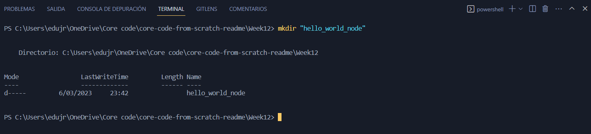


##### 01
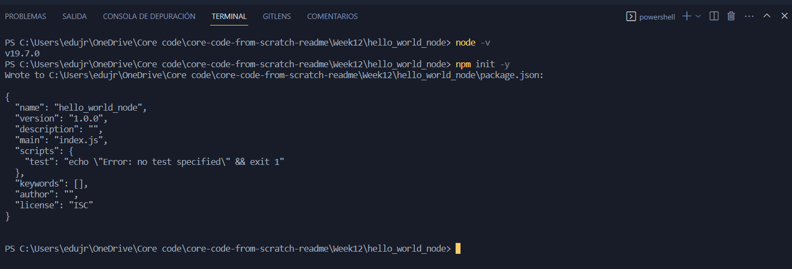


##### 02


**Node.JS Module System**


##### 00


##### 01
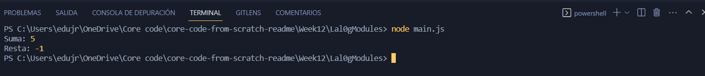

##### 01
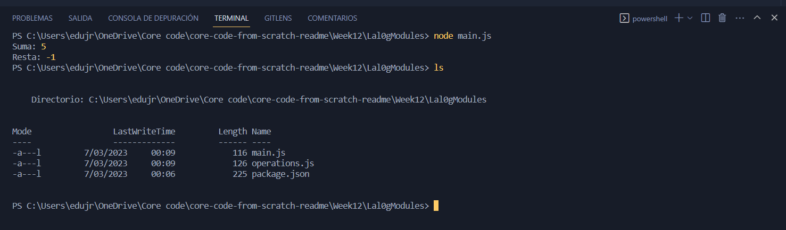

```json
{
  "name": "lal0gmodules",
  "version": "1.0.0",
  "description": "",
  "main": "main.js",
  "scripts": {
    "test": "echo \"Error: no test specified\" && exit 1"
  },
  "keywords": [],
  "author": "",
  "license": "ISC"
}
```


# MIÉRCOLES 15 DE FEBRERO DEL 2023
**Client-Server Model Learning Exercise 🧠**

- ¿Qué es un servidor?
- - Un servidor es un conjunto de computadoras los cuales son capaces de atender las peticiones de un cliente y devolverle una respuesta en concordancia.
- ¿Qué es un cliente?
- - Los clientes centralizan diferentes aplicaciones y recursos en el servidor.
- ¿Es un servidor solo otra computadora física?
- - No necesariamente. Un servidor puede ser una computadora física dedicada exclusivamente a la tarea de proporcionar servicios a otras computadoras en una red. Sin embargo, también es posible tener un servidor virtual que se ejecuta en una máquina física y proporciona servicios a través de Internet o una red local. Además, un servidor también puede ser un software que se ejecuta en una computadora y proporciona servicios a otras computadoras, sin necesidad de una máquina física dedicada.
- - ¿Por qué nos referimos a cierta clase de aplicaciones como Servidores?
- - - Nos referimos a cierta clase de aplicaciones como "servidores" porque su función principal es la de proveer un servicio o recurso a otras aplicaciones o dispositivos. Estas aplicaciones se ejecutan continuamente en segundo plano y esperan peticiones de otras aplicaciones o dispositivos para procesarlas y responderlas.

- - - Por ejemplo, un servidor web es una aplicación que provee páginas web a los navegadores web que las solicitan. Un servidor de correo electrónico es una aplicación que provee la funcionalidad de envío y recepción de correos electrónicos a los clientes de correo electrónico que los utilizan. En ambos casos, el servidor es la aplicación que provee un servicio a otra aplicación o dispositivo.
- - ¿Cuál es la diferencia?
- - - La diferencia entre un servidor y un cliente es que un servidor proporciona servicios o recursos a otras computadoras o programas, mientras que un cliente accede a esos servicios o recursos desde el servidor.
- ¿Existe alguna similitud entre la comunicación humana y el modelo cliente-servidor?
- - Sí, hay algunas similitudes entre la comunicación humana y el modelo cliente-servidor. En ambos casos, hay dos partes involucradas que se comunican entre sí para lograr un objetivo. En la comunicación humana, las partes pueden ser dos personas o un grupo de personas que interactúan entre sí para compartir información, ideas o lograr algún objetivo. En el modelo cliente-servidor, las partes son una aplicación cliente y un servidor que se comunican entre sí para compartir información o realizar alguna tarea.

- - Además, tanto en la comunicación humana como en el modelo cliente-servidor, la comunicación puede ser bidireccional, es decir, ambas partes pueden enviar y recibir información. También se pueden establecer acuerdos o protocolos de comunicación para que ambas partes se entiendan mejor y logren su objetivo de manera efectiva. En resumen, aunque son diferentes en muchos aspectos, la comunicación humana y el modelo cliente-servidor comparten algunas similitudes en términos de interacción y comunicación entre dos partes para lograr un objetivo común.
- ¿El modelo cliente-servidor es aplicable sólo a la Web?
- - No, el modelo cliente-servidor es un modelo arquitectónico ampliamente utilizado en la informática y no se limita solo a la Web. De hecho, este modelo se utiliza en una amplia variedad de sistemas, desde sistemas operativos y bases de datos hasta juegos en línea y servicios de mensajería. La idea básica detrás del modelo cliente-servidor es la separación de las responsabilidades de procesamiento y almacenamiento de datos entre diferentes componentes del sistema, lo que permite una mejor escalabilidad y mantenimiento. En la Web, el modelo cliente-servidor se aplica a menudo a través del protocolo HTTP (Hypertext Transfer Protocol) y se utiliza para la comunicación entre los navegadores web (clientes) y los servidores web.


**HTTP Core Understanding Learning Exercise 🧠**


- ¿Qué es HTTP?
- - HTTP (Hypertext Transfer Protocol) es un protocolo de comunicación utilizado para transferir datos en la World Wide Web (WWW). Se utiliza para solicitar y enviar recursos en la web, como HTML, imágenes, archivos, etc. HTTP funciona como un protocolo de solicitud-respuesta entre un cliente y un servidor. El cliente envía una solicitud HTTP al servidor, que luego procesa la solicitud y devuelve una respuesta HTTP al cliente. El protocolo HTTP utiliza el puerto 80 como puerto predeterminado para la comunicación entre el cliente y el servidor, aunque puede utilizarse cualquier otro puerto. HTTP es un protocolo sin estado, lo que significa que el servidor no mantiene ninguna información sobre las solicitudes previas realizadas por el cliente.
- ¿Qué es un Protocolo de Comunicación?
- - Un protocolo de comunicación es un conjunto de reglas y convenciones que se establecen para permitir que dos o más dispositivos se comuniquen e intercambien información de manera estandarizada y ordenada. Los protocolos definen el formato de los mensajes que se intercambian, la sintaxis y semántica del lenguaje utilizado para transmitir información y las normas que rigen el flujo de la comunicación entre los dispositivos. Los protocolos de comunicación son esenciales para que los dispositivos puedan comunicarse de manera eficiente y efectiva. Ejemplos de protocolos de comunicación incluyen TCP/IP, HTTP, FTP, SMTP, y muchos otros.
- - ¿Los humanos usan protocolos de comunicación?
- - - Sí, los humanos utilizan protocolos de comunicación. Un protocolo de comunicación es un conjunto de reglas y convenciones que gobiernan el intercambio de información entre dos o más entidades. En la comunicación humana, las reglas pueden ser explícitas o implícitas y pueden variar según el contexto y la cultura. Por ejemplo, en una conversación informal, puede haber menos reglas explícitas y los participantes pueden ser más propensos a interrumpirse o superponerse en su habla. En una situación más formal, como una entrevista de trabajo o una reunión de negocios, las reglas pueden ser más explícitas y los participantes pueden ser más cuidadosos de seguir las convenciones de turno de palabra y etiqueta apropiada.
- ¿Qué es una Solicitud en HTTP?
- - En HTTP, una solicitud (request) es un mensaje enviado por el cliente (como un navegador web) a un servidor web para solicitar un recurso. Una solicitud HTTP consta de dos partes principales: una línea de solicitud (request line) y un conjunto de encabezados (headers).
- ¿Qué es una Respuesta en HTTP?
- - En el contexto de HTTP, una respuesta es el mensaje que un servidor envía a un cliente después de recibir una solicitud. La respuesta contiene información sobre si la solicitud fue exitosa o no, y en caso de ser exitosa, puede incluir los datos solicitados por el cliente.
- ¿Qué es un método HTTP?
- -  Un método HTTP es una acción que se puede realizar sobre un recurso identificado por una URL. Los métodos HTTP son utilizados por los clientes para solicitar operaciones en los servidores.
- ¿Qué son los encabezados de solicitud HTTP?
- - Los encabezados de solicitud HTTP son información adicional enviada por un cliente al servidor en una solicitud HTTP. Estos encabezados proporcionan información sobre la solicitud misma y pueden incluir información sobre el cliente que realiza la solicitud, el tipo de contenido que se está solicitando, los parámetros de autenticación, la codificación de caracteres utilizada y más.

**APIs Core Understanding Learning Exercise 🧠**


- ¿Qué es una API?
- - Una API ​es una pieza de código que permite a diferentes aplicaciones comunicarse entre sí y compartir información y funcionalidades. Una API es un intermediario entre dos sistemas, que permite que una aplicación se comunique con otra y pida datos o acciones específicas.
- ¿Qué es un Protocolo?
- - En informática y telecomunicación, un protocolo de comunicaciones es un sistema de reglas que permiten que dos o más entidades de un sistema de comunicación se comuniquen entre ellas para transmitir información por medio de cualquier tipo de variación de una magnitud física
- ¿El término API sólo es aplicable a la comunicación de programas a través de Internet?
- - No, el término API (Application Programming Interface o Interfaz de Programación de Aplicaciones) no se limita únicamente a la comunicación de programas a través de Internet. Una API es una interfaz que define cómo interactuar con un componente de software, permitiendo a los desarrolladores acceder y utilizar las funcionalidades que ofrece dicho componente. Esto puede ser utilizado tanto en aplicaciones de escritorio, como en aplicaciones web o móviles, y en cualquier otro tipo de software que requiera la interacción con componentes externos.
- 
- ¿Por qué es importante la comunicación estructurada entre dos programas?
- -  La comunicación estructurada entre dos programas es importante por varias razones:

- - - Interoperabilidad: cuando dos programas necesitan comunicarse, es importante que ambos puedan entenderse para que la comunicación sea efectiva. Una comunicación estructurada permite a los programas hablar un mismo idioma y entender los datos que intercambian.

- - - Escalabilidad: si un programa tiene que comunicarse con muchos otros programas, una comunicación estructurada permite que se establezcan patrones predecibles y estandarizados que pueden ser escalados de manera más fácil.

- - - Facilidad de mantenimiento: al tener una estructura clara en la comunicación entre dos programas, se hace más fácil mantener y actualizar los programas, ya que cualquier cambio en la estructura puede ser fácilmente reflejado en ambos programas.

- - - Reusabilidad: la comunicación estructurada permite que el código que se utiliza para comunicar dos programas pueda ser reutilizado en otros proyectos, lo que reduce la cantidad de código que debe ser escrito desde cero.
- - - ¿Los humanos usamos API cuando nos comunicamos sin tecnología?
- - - - Sí, de alguna manera, los humanos también utilizamos API cuando nos comunicamos sin tecnología. El término "API" significa "Interfaz de Programación de Aplicaciones", y se refiere a una interfaz definida que permite a dos programas comunicarse entre sí. En el caso de los seres humanos, la comunicación estructurada y definida se produce a través de lenguajes naturales, como el inglés, el español, el francés, etc. Estos lenguajes tienen reglas gramaticales y sintácticas definidas que permiten a los hablantes comunicarse efectivamente y comprender el mensaje transmitido. En cierto sentido, se podría decir que los idiomas humanos son una forma de API que permite a los seres humanos comunicarse de manera estructurada y efectiva.


- ¿Una API es un programa más o un estándar?
- - Una API (Application Programming Interface) es un conjunto de definiciones, protocolos y herramientas que se utilizan para construir software y aplicaciones. Puede incluir estándares de comunicación, formatos de datos y otras especificaciones que permiten a los desarrolladores interactuar con el software o servicio proporcionado por la API.

- - En este sentido, una API no es un programa en sí mismo, sino un conjunto de reglas y herramientas que permiten a los desarrolladores crear programas que se comuniquen con otro software o servicio. Por lo tanto, una API puede ser vista como un estándar o una especificación para la comunicación entre programas.


- ¿Conoces alguna API? ¿Puede enumerar al menos 5 ejemplos de API?
- - Google Maps API
- - Twitter API
- - OpenWeatherMap API
- - Spotify API
- - Amazon Web Services (AWS)

**From JSON to REST Learning Exercise 🧠**

- ¿Qué es JSON?
- - JSON es un formato de texto sencillo para el intercambio de datos. Se trata de un subconjunto de la notación literal de objetos de JavaScript, aunque, debido a su amplia adopción como alternativa a XML, se considera un formato independiente del lenguaje.
- - ¿JSON es lo mismo que un objeto Javascript simple?
- - - JSON y un objeto Javascript son similares en su sintaxis, pero tienen diferentes propósitos y funcionalidades.
- ¿Qué es REST?
- - La transferencia de estado representacional o REST es un estilo de arquitectura software para sistemas hipermedia distribuidos como la World Wide Web.
- - ¿Es REST un lenguaje de programación, un marco, una tecnología o un patrón de arquitectura?
- - - REST es un patrón de arquitectura para diseñar servicios web, no es un lenguaje de programación, un marco o una tecnología específica. Se basa en el protocolo HTTP y se enfoca en recursos y operaciones CRUD (Create, Read, Update, Delete) sobre esos recursos utilizando los verbos HTTP. El diseño RESTful se centra en la simplicidad, la escalabilidad y la interoperabilidad entre sistemas.
- ¿Qué es un Recurso en REST?
- - En REST, un recurso es cualquier objeto o entidad que pueda ser identificado, manipulado y representado por medio de una URI (Uniform Resource Identifier), por ejemplo, un objeto en una base de datos, un archivo en el sistema de archivos o cualquier entidad que pueda ser considerada como una entidad única y direccionable.
- - ¿Qué es un identificador de recursos?
- - - Un identificador de recursos, también conocido como URI (Uniform Resource Identifier), es una cadena de caracteres que se utiliza para identificar un recurso específico en la Web. En el contexto de REST, cada recurso debe tener un URI único que lo identifique. Por ejemplo, el URI "https://www.ejemplo.com/productos/123" podría identificar el recurso "producto" con el ID "123". Los identificadores de recursos son importantes en REST porque permiten a los clientes y servidores comunicarse de manera clara y unívoca sobre los recursos que se están accediendo o manipulando.
- ¿Cómo se relacionan HTTP y REST?
- - HTTP y REST están estrechamente relacionados, ya que REST es un estilo arquitectónico que se basa en el protocolo HTTP para crear servicios web escalables y flexibles.
- - ¿Qué métodos HTTP usa REST dentro de sus reglas de arquitectura?
- - - GET, POST, PUT, DELETE, PATCH, HEAD, OPTIONS
- - ¿Por qué usamos métodos HTTP en REST y cómo se relacionan con los recursos?
- - -  En REST, se utilizan los métodos HTTP para indicar la acción que se realizará sobre un recurso específico. Los métodos HTTP definen operaciones que se pueden realizar en los recursos identificados mediante un URI. A continuación, se describen los métodos HTTP más comunes que se utilizan en REST: GET, POST, PUT, DELETE.
- ¿Es REST lo mismo que HTTP?
- - No, REST y HTTP son cosas diferentes, aunque están relacionados. REST es un patrón de diseño de arquitectura de software que se utiliza para crear servicios web. HTTP, por otro lado, es un protocolo de comunicación que se utiliza para transferir datos a través de la web. REST utiliza HTTP como uno de los medios para la transferencia de datos, junto con otros protocolos como HTTPS, SMTP y FTP. Además, REST establece ciertas reglas y restricciones en la forma en que se deben utilizar los métodos HTTP para operar con los recursos, mientras que HTTP en sí mismo simplemente proporciona una serie de métodos y códigos de estado para que los desarrolladores los utilicen como consideren necesario.


**REST API Clients Learning Exercise 🧠**


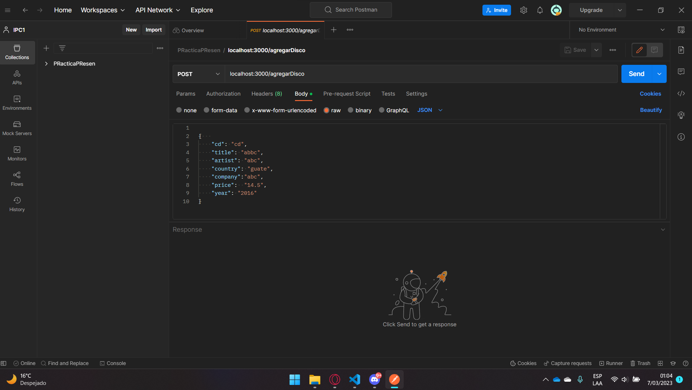


- ¿Postman solo funciona con API REST?
- - No, Postman es una herramienta de colaboración de API que admite diferentes tipos de API, incluidas las API RESTful y las no RESTful. También es compatible con la prueba de servicios web SOAP, API GraphQL, solicitudes HTTP generales y más.
- ¿Hay alguna alternativa a Postman?
- - SoapUI
- - Testfully
- - Insomnia
- - Hoppscotch
- - Paw
- - Thunder Client
- - Postcode
- - Firecamp
- - TestMace

# JUEVES 16 DE FEBRERO DE 2023

**Express.JS Core Understanding Learning Exercise 🧠**


###### npm init
```json
{
  "name": "lalogsapp",
  "version": "1.0.0",
  "description": "",
  "main": "index.js",
  "scripts": {
    "test": "echo \"Error: no test specified\" && exit 1"
  },
  "keywords": [],
  "author": "",
  "license": "ISC",
  "dependencies": {
    "express": "^4.18.2"
  }
}
```


###### app.js
```javascript
const express = require('express')
const app = express()
const port = 3000

app.get('/', (req, res) => {
  res.send('Hello World!')
})

app.listen(port, () => {
  console.log(`Example app listening on port ${port}`)
})

```


###### screen verification

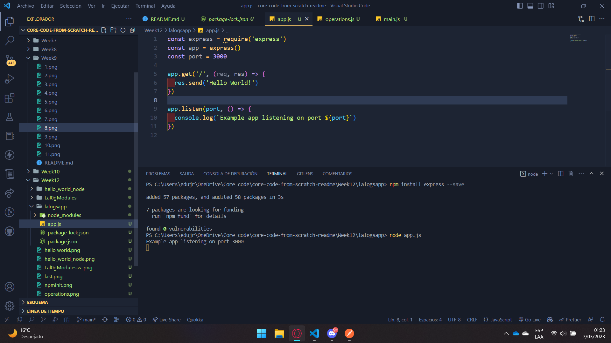


###### screen verification

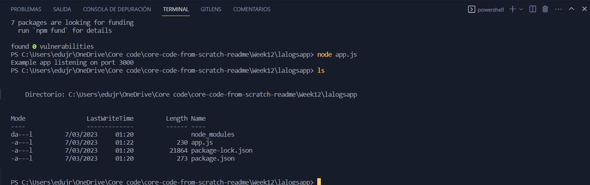


###### screen verification


**Forrest Gump Ping-Pong API 🏓 Practice 💻**


###### npm init
```json
{
  "name": "pingponlalogs",
  "version": "1.0.0",
  "description": "",
  "main": "index.js",
  "scripts": {
    "test": "echo \"Error: no test specified\" && exit 1"
  },
  "keywords": [],
  "author": "",
  "license": "ISC",
  "dependencies": {
    "express": "^4.18.2"
  }
}

```

###### index.js
```javascript
const express = require('express')
const app = express()
const port = 3000
app.use(express.json());
app.post('/api/buba-gump', (req, res) => {
    const { message } = req.body;
    if(message === "ping") 
    {
        res.send("pong");
    } else if(message === "pong") 
    {
        res.send("ping");
    } else 
    {
        res.send("Invalid message");
    }
})

app.listen(port, () => {
  console.log(`Running app listening on port ${port}`)
})

```


###### screen verification


###### screen verification

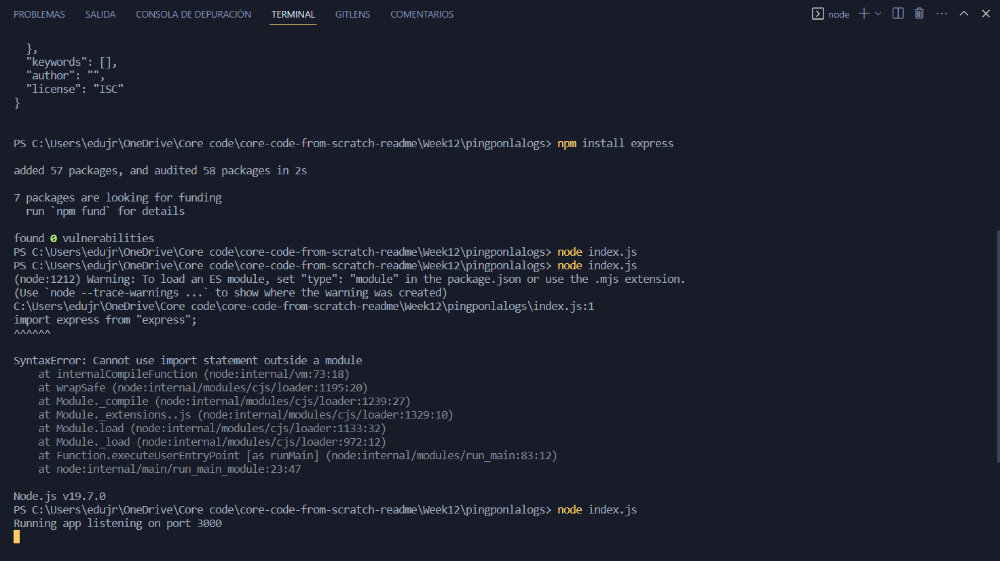

###### screen verification

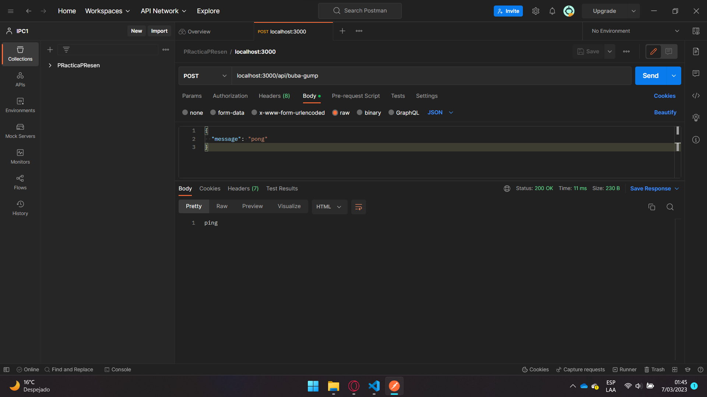

###### screen verification


###### screen verification

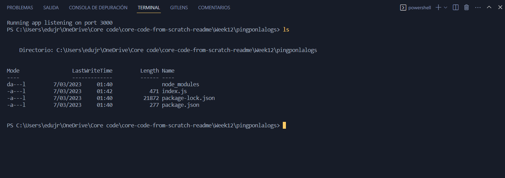


**Delayed Response API ⏳ Practice 💻**


###### npm init
```json
{
  "name": "dealyapp",
  "version": "1.0.0",
  "description": "",
  "main": "index.js",
  "scripts": {
    "test": "echo \"Error: no test specified\" && exit 1"
  },
  "keywords": [],
  "author": "",
  "license": "ISC",
  "dependencies": {
    "express": "^4.18.2"
  }
}

```

###### app1.js
```javascript
const express = require('express')
const app = express()
const port = 3000

app.use(express.json());

app.get('/api/delay/:delay', (req, res) => {
    let delay = req.params.delay;

    if(delay == undefined || delay == null || delay == "") {
        delay = 1000;
    }
    
    setTimeout(() => {
        res.send(`Delayed response by ${delay} ms`)
    }, delay);
})

app.get('/api/delay', (req, res) => {
    setTimeout(() => {
        res.send(`Delayed response by 1000 ms`)
    }, 1000);
})

app.listen(port, () => {
  console.log(`Running app listening on port ${port}`)
})

```


###### screen verification

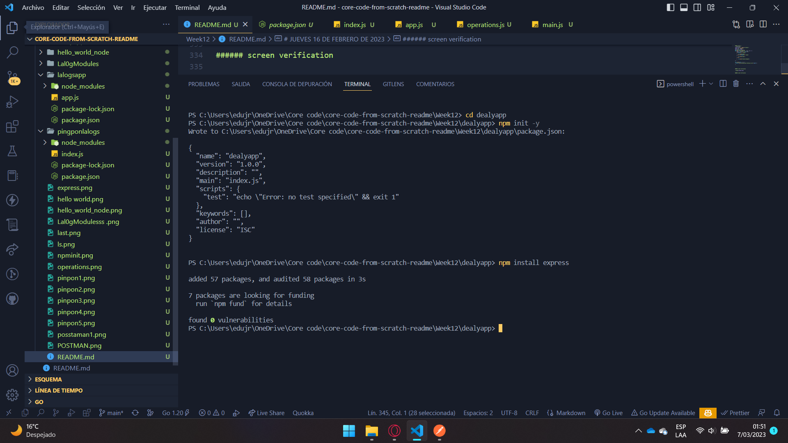


###### screen verification


###### screen verification


###### screen verification

