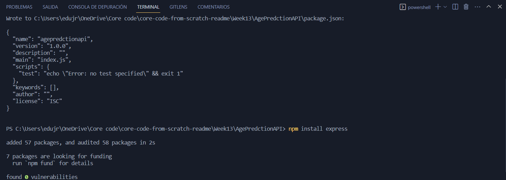

# LUNES 20 DE FEBRERO DE 2023


**Age Prediction API 👶-👴**
###### npm init
```json
{
{
  "name": "agepredctionapi",
  "version": "1.0.0",
  "description": "",
  "main": "index.js",
  "scripts": {
    "test": "echo \"Error: no test specified\" && exit 1"
  },
  "keywords": [],
  "author": "",
  "license": "ISC",
  "dependencies": {
    "express": "^4.18.2"
  }
}

}
```


###### app0.js
```javascript
const express = require('express')
const app = express()
const port = 3000

app.use(express.json());


app.get('/api/age/:name', (req, res) => {
    let name = req.params.name;

    let anio = getRandomIntInclusive(1, 99);
    if(name != undefined){
        res.send({
            "name": name,
            "age": anio,
            "days": anio %4 == 0 ? anio *366 : anio *365
        });
    }else{
        res.send({
            "error": "Missing parameter 'name' was expected."
        });
    }
})

app.get('/api/age', (req, res) => {
    let r = {
        error: "Missing parameter 'name' was expecteds."
    }

    res.json(r);
})

const getRandomIntInclusive = (min, max) => {
    min = Math.ceil(min);
    max = Math.floor(max);
    return Math.floor(Math.random() * (max - min + 1) + min);
}

app.listen(port, () => {
  console.log(`Running app listening on port ${port}`)
})
```


###### screen verification


###### screen verification


###### screen verification


###### screen verification



**NSA Secrets Box API - Hacking Challenge 👨‍💻**
**The SQL Murder Mystery Walkthrough - Learning Exercise**


